<!--more-->

> [!TIP]
> More examples of PlantUML could be found https://plantuml.com/en/. And all test cases, except the [Sequence Diagram](#sequence-diagram) and [Use Case Diagram](#use-case-diagram), are copied from it for testing rendering PlantUML in DoIt.

## UML Diagrams

###  Sequence Diagram

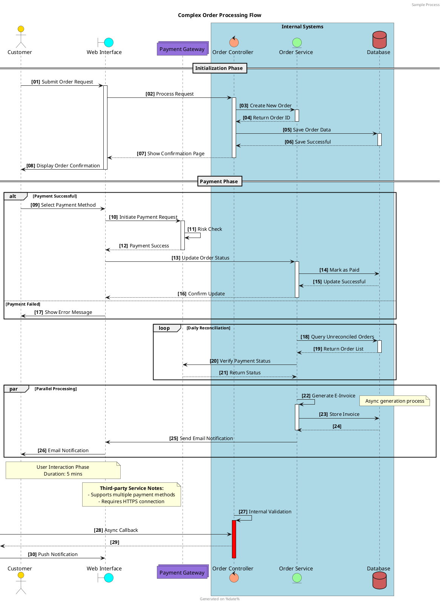

### Use Case Diagram

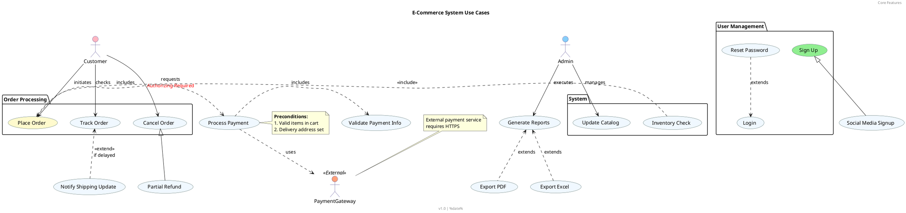

### Class Diagram

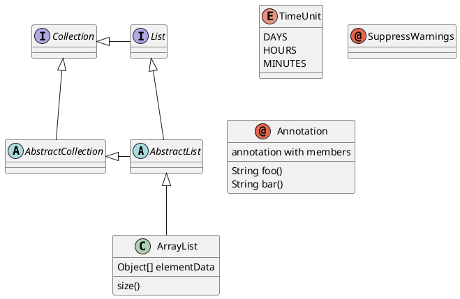

### Activity Diagram (New Syntax)

*Note: The old syntax of activity diagram is not recommended.*

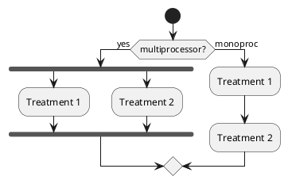

### Component Diagram

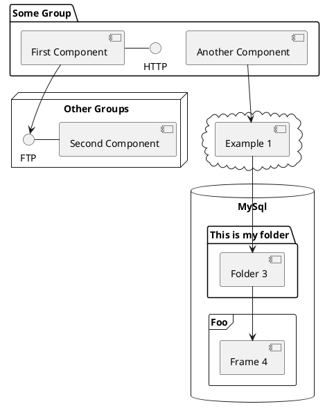

### State Diagram

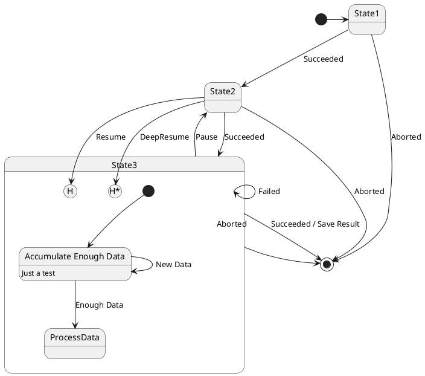

### Object Diagram

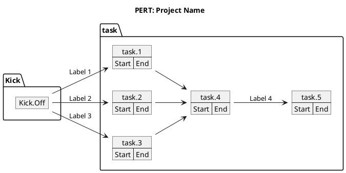

### Deployment Diagram

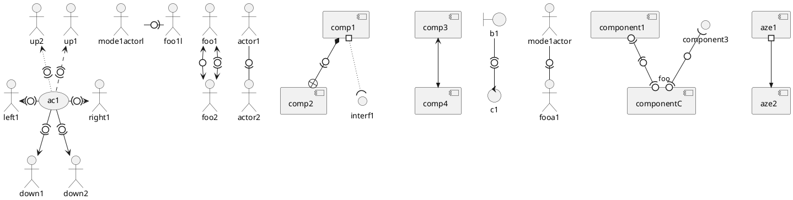

## Non-UML Diagrams

### Regex Diagram

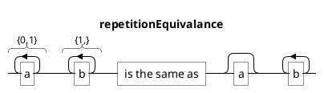
### JSON Diagram

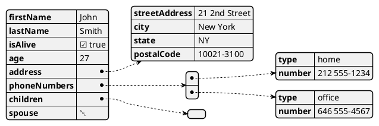

### YAML Diagram

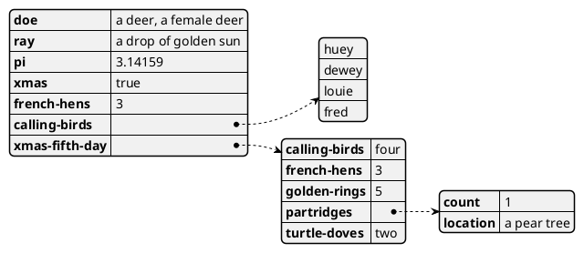
