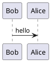

Find out how to create and organize your content quickly and intuitively in **DoIt** theme.

<!--more-->

## Contents Organization {#contents-organization}

A few suggestions to help you get a good looking site quickly:

* Keep post pages in the `content/posts` directory, for example: `content/posts/my-first-post.md`
* Keep other pages in the `content` directory, for example: `content/about.md`
* Local resources organization




There are three ways to reference local resources such as **images** and **music**:

1. Using [page resources](https://gohugo.io/content-management/page-resources/) in [page bundles](https://gohugo.io/content-management/page-bundles/).
   You can reference page resources by the value for `Resources.GetMatch` or the filepath of the resource relative to the page directory directly.
2. Store resources in the **assets** directory, which is `/assets` by default.
   The filepath of the resource to reference in the post is relative to the assets directory.
3. Store resources in the **static** directory, which is `/static` by default.
   The filepath of the resource to reference in the post is relative to the static directory.

The **priority** of references is also in the above order.

There are many places in the theme where the above local resource references can be used,
such as **links**, **images**, `image` shortcode, `music` shortcode and some params in the **front matter**.

Images in page resources or assets directory [processing](https://gohugo.io/content-management/image-processing/)
will be supported in the future.
It's really cool! 


## Author Settings {#author-setup}

You are encouraged to create your author profile under `mysite/data/authors` as `author_name.toml`. In your profile, you can specify the link, email and name with i18n support.

Here is an example for `Alice.toml`:

```toml
link = "https://alice.example.com"
email = "alice@example.com"
name = "Alice"
[zh-cn]
    name = "爱丽丝"
```

After creating your author profile, you can specify your name in the front matter of your posts. After that, the post will be automatically signed with your name and link, and will be classified according to its author.

```yaml
---
authors: [Alice]
---
```

You can also specify multiple authors for one post.

```yaml
---
authors: [Alice, Bob, Catherine]
---
```

## Front Matter {#front-matter}

**Hugo** allows you to add front matter in `yaml`, `toml` or `json` to your content files.


**Not all** of the below front matters need to be set in each of your posts.
It is necessary only if the front matters and the `page` part in your [site configuration](../theme-documentation-basics#site-configuration) are inconsistent.


Here is a front matter example:

```yaml
---
title: "My First Post"
subtitle: ""
date: 2020-03-04T15:58:26+08:00
lastmod: 2020-03-04T15:58:26+08:00
draft: true
authors: []
description: ""
license: ""
images: []

tags: []
categories: []
series: []
series_weight: 1
seriesNavigation: true
featuredImage: ""
featuredImagePreview: ""

hiddenFromHomePage: false
hiddenFromSearch: false
twemoji: false
lightgallery: true
ruby: true
fraction: true
linkToMarkdown: true
linkToSource: false
linkToEdit: false
linkToReport: false
rssFullText: false
license: ''

toc:
  enable: true
  auto: true
code:
  copy: true
  # ...
table:
  sort: true
  # ...
math:
  enable: true
  # ...
mapbox:
  accessToken: ""
  # ...
share:
  enable: true
  # ...
comment:
  enable: true
  # ...
library:
  css:
    # someCSS = "some.css"
    # located in "assets/"
    # Or
    # someCSS = "https://cdn.example.com/some.css"
  js:
    # someJS = "some.js"
    # located in "assets/"
    # Or
    # someJS = "https://cdn.example.com/some.js"
seo:
  images: []
  # ...
outdatedArticleReminder:
  enable: false
  # ...
sponsor:
  enable: false
  # ...
related:
  enable: false
  count: 5
---
```

* **title**: the title for the content.
* **subtitle**:  the subtitle for the content.
* **date**: the datetime assigned to this page, which is usually fetched from the `date` field in front matter, but this behaviour is configurabl in the [site configuration](../theme-documentation-basics#site-configuration).
* **lastmod**: the datetime at which the content was last modified.
* **draft**: if `true`, the content will not be rendered unless the `--buildDrafts`/`-D` flag is passed to the `hugo` command.
* **authors**:  the list of authors for the content.
* **description**: the description for the content.
* **license**: the special license for this content.
* **images**: page images for Open Graph and Twitter Cards.

* **tags**: the tags for the content.
* **categories**: the categories for the content.
* **series**:  the series for the content.
* **series_weight**:  define the [position](https://gohugo.io/content-management/taxonomies/#order-taxonomies) of the post in the series.
* **seriesNavigation**:  whether to enable series navigation.
* **featuredImage**: the featured image for the content.
* **featuredImagePreview**: the featured image for the content preview in the home page.

* **hiddenFromHomePage**: if `true`, the content will not be shown in the home page.
* **hiddenFromSearch**:  if `true`, the content will not be shown in the search results.
* **twemoji**:  if `true`, the content will enable the twemoji.
* **lightgallery**: if `true`, images in the content will be shown as the gallery.
* **ruby**:  if `true`, the content will enable the [ruby extended syntax](#ruby).
* **fraction**:  if `true`, the content will enable the [fraction extended syntax](#fraction).
* **linkToMarkdown**: if `true`, the footer of the content will be shown the link to the original Markdown file.
* **linkToSource**:  if `false`, turn off the **view source** link in the footer. You can set it to the link to the source file of the post. Use the magic variable `{path}` to specify the relative path of the post, for example, the `{path}` for this post is `posts/theme-documentation-content/index.en.md`.
* **linkToEdit**:  if `false`, turn off the **edit this page** link in the footer. You can set it to the link to edit the page. Use the magic variable `{path}` to specify the relative path of the post, for example, the `{path}` for this post is `posts/theme-documentation-content/index.en.md`.
* **linkToReport**:  if `false`, turn off the **report issue** link in the footer. You can set it to the link to report issues about the page. Use the magic variables: `{path}` to specify the relative path of the post, for example, the `{path}` for this post is `posts/theme-documentation-content/index.en.md`, `{title}` to specify the title of the post, for example, the `{title}` for this post is `Theme Documentation - Content` and `{url}` to specify the url of the post, for example, the `{url}` for this post is `https://hugodoit.pages.dev/theme-documentation-content/`.
* **rssFullText**:  if `true`, the full text content will be shown in RSS.
* **enableLastMod**: if `true`, the last modified time will be shown in the header.
* **enableWordCount**: if `true`, the word count will be shown in the header.
* **enableReadingTime**: if `true`, the reading time will be shown in the header.
* **license**:  set the license info (HTML format is supported).

* **toc**:  the same as the `params.page.toc` part in the [site configuration](../theme-documentation-basics#site-configuration).
* **code**:  the same as the `params.page.code` part in the [site configuration](../theme-documentation-basics#site-configuration).
* **table**:  the same as the `params.page.table` part in the [site configuration](../theme-documentation-basics#site-configuration).
* **math**:  the same as the `params.page.math` part in the [site configuration](../theme-documentation-basics#site-configuration).
* **mapbox**:  the same as the `params.page.mapbox` part in the [site configuration](../theme-documentation-basics#site-configuration).
* **share**: the same as the `params.page.share` part in the [site configuration](../theme-documentation-basics#site-configuration).
* **comment**:  the same as the `params.page.comment` part in the [site configuration](../theme-documentation-basics#site-configuration).
* **library**:  the same as the `params.page.library` part in the [site configuration](../theme-documentation-basics#site-configuration).
* **seo**:  the same as the `params.page.seo` part in the [site configuration](../theme-documentation-basics#site-configuration).
* **outdatedArticleReminder**:  the same as the `params.page.outdatedArticleReminder` part in the [site configuration](../theme-documentation-basics#site-configuration).
* **sponsor**:  the same as the `params.sponsor` part in the [site configuration](../theme-documentation-basics#site-configuration).
* **related**:  the same as the `params.page.related` part in the [site configuration](../theme-documentation-basics#site-configuration).




**featuredImage** and **featuredImagePreview** support the complete usage of [local resource references](#contents-organization).

If the page resource with `name: featured-image` or `name: featured-image-preview` is set in the front matter,
it is not necessary to set the parameter `featuredImage` or `featuredImagePreview`:

```yaml
resources:
- name: featured-image
  src: featured-image.jpg
- name: featured-image-preview
  src: featured-image-preview.jpg
```


## Content Summaries

**DoIt** theme uses the summary of the content to display abstract information in the home page. Hugo can generate summaries of your content.



### Automatic Summary Splitting

By default, Hugo automatically takes the first 70 words of your content as its summary.

You may customize the summary length by setting `summaryLength` in the [site configuration](../theme-documentation-basics#site-configuration).

If you are creating content in a [CJK]^(Chinese/Japanese/Korean) language and want to use Hugo’s automatic summary splitting, set `hasCJKLanguage` to `true` in your [site configuration](../theme-documentation-basics#site-configuration).

### Manual Summary Splitting

Alternatively, you may add the `<!--more-->` summary divider where you want to split the article.

Content that comes before the summary divider will be used as that content’s summary.


Be careful to enter `<!--more-->` exactly; i.e., all lowercase and with no whitespace.


### Front Matter Summary

You might want your summary to be something other than the text that starts the article. In this case you can provide a separate summary in the `summary` variable of the article front matter.

### Use Description as Summary

You might want your description in the `description` variable of the article front matter as the summary.

You may add the `<!--more-->` summary divider at the start of the article. Keep content that comes before the summary divider empty. Then **DoIt** theme will use your description as the summary.

### Priority Order of Summary Selection

Because there are multiple ways in which a summary can be specified it is useful to understand the order. It is as follows:

1. If there is a `<!--more-->` summary divider present in the article but no content is before the divider, the description will be used as the summary.
2. If there is a `<!--more-->` summary divider present in the article the text up to the divider will be provided as per the manual summary split method.
3. If there is a summary variable in the article front matter the value of the variable will be provided as per the front matter summary method.
4. The text at the start of the article will be provided as per the automatic summary split method.


It is not recommended to include rich text block elements in the summary, which will cause typographic errors. Such as code blocks, pictures, tables, etc.


## Basic Markdown Syntax

This part is shown in the [basic markdown syntax page](../basic-markdown-syntax/).

## Extended Markdown Syntax {#extended-markdown-syntax}

**DoIt** theme has some extended syntax elements for you to write articles.

### Emoji Support

This part is shown in the [emoji support page](../emoji-support/).

### Mathematical Formula

**DoIt** theme supports mathematical formulas based on [$ \KaTeX $](https://katex.org/).

Set the followings in your [site configuration](../theme-documentation-basics#site-configuration) to enable mathematical formulas.

```toml {title="hugo.toml"}
[markup]
  [markup.goldmark]
    [markup.goldmark.extensions]
      [markup.goldmark.extensions.passthrough]
        enable = true
        [markup.goldmark.extensions.passthrough.delimiters]
          block = [['\[', '\]']]
          inline = [['\(', '\)']]
[params]
  [page]
    [page.math]
      enable = true
      blockLeftDelimiter = '\['
      blockRightDelimiter = '\]'
      inlineLeftDelimiter = '\('
      inlineRightDelimiter = '\)'
      copyTex = true
      mhchem = true
```


Here is a list of [$ \TeX $ functions supported by $ \KaTeX $](https://katex.org/docs/supported.html).


#### Block Formula

The default block delimiters is `\[ \]`:

```markdown {linenos=false}
\[ c = \pm\sqrt{a^2 + b^2} \]

\[ f(x)=\int_{-\infty}^{\infty} \hat{f}(\xi) e^{2 \pi i \xi x} d \xi \]
```

The rendered output looks like this:

\[ c = \pm\sqrt{a^2 + b^2} \]

\[ f(x)=\int_{-\infty}^{\infty} \hat{f}(\xi) e^{2 \pi i \xi x} d \xi \]

#### Inline Formula

The default inline delimiters is `\( \)`:

```markdown
\( c = \pm\sqrt{a^2 + b^2} \) and \( f(x)=\int_{-\infty}^{\infty} \hat{f}(\xi) e^{2 \pi i \xi x} d \xi \)
```

The rendered output looks like this:

\( c = \pm\sqrt{a^2 + b^2} \) and \( f(x)=\int_{-\infty}^{\infty} \hat{f}(\xi) e^{2 \pi i \xi x} d \xi \)

#### Copy-tex

**[Copy-tex](https://github.com/KaTeX/KaTeX/tree/main/contrib/copy-tex)** is an extension for **$ \KaTeX $**.

By the extension, when selecting and copying $ \KaTeX $ rendered elements, copies their $ \LaTeX $ source to the clipboard.

Set the property `copyTex = true` under `[params.math]` in your [site configuration](../theme-documentation-basics#site-configuration) to enable Copy-tex.

Select and copy the formula rendered in the previous section, and you can find that the copied content is the LaTeX source code.

#### mhchem

**[mhchem](https://github.com/KaTeX/KaTeX/tree/main/contrib/mhchem)** is an extension for **$ \KaTeX $**.

By the extension, you can write beautiful chemical equations easily in the article.

Set the property `mhchem = true` under `[params.math]` in your [site configuration](../theme-documentation-basics#site-configuration) to enable mhchem.

```markdown
\[ \ce{CO2 + C -> 2 CO} \]

\[ \ce{Hg^2+ ->[I-] HgI2 ->[I-] [Hg^{II}I4]^2-} \]
```

The rendered output looks like this:

\[ \ce{CO2 + C -> 2 CO} \]

\[ \ce{Hg^2+ ->[I-] HgI2 ->[I-] [Hg^{II}I4]^2-} \]

### Ruby Annotation {#ruby}

An extended Markdown syntax for **ruby annotation** is supported in **DoIt** theme:

```markdown
[Hugo]{?^}(An open-source static site generator)
```

The rendered output looks like this:

[Hugo]^(An open-source static site generator)

### Fraction {#fraction}



An extended Markdown syntax for **fraction** is supported in **DoIt** theme:

```markdown
[Light]{?/}[Dark]

[99]{?/}[100]
```

The rendered output looks like this:

[Light]/[Dark]

[90]/[100]

### Blockquote

**DoIt** supports GitHub-style blockquotes:

```markdown {open=true}
> [!NOTE]
> Useful information that users should know, even when skimming content.

> [!TIP]
> Helpful advice for doing things better or more easily.

> [!IMPORTANT]
> Key information users need to know to achieve their goal.

> [!WARNING]
> Urgent info that needs immediate user attention to avoid problems.

> [!CAUTION]
> Advises about risks or negative outcomes of certain actions.
```

The rendered output looks like this:

> [!NOTE]
> Useful information that users should know, even when skimming content.

> [!TIP]
> Helpful advice for doing things better or more easily.

> [!IMPORTANT]
> Key information users need to know to achieve their goal.

> [!WARNING]
> Urgent info that needs immediate user attention to avoid problems.

> [!CAUTION]
> Advises about risks or negative outcomes of certain actions.

### PlantUML Support

**DoIt** supports [PlantUML](https://plantuml.com/en/) diagrams:

~~~markdown

~~~

The rendered output looks like this:


You can customize the rendered image with following optional parameters:

option | description | type
--- | --- | ---
`format` | output format of PlantUML renderer, either `svg` (default) or `png` | string
`title` | will be rendered as attribute `alt` of tag `` | string

### WaveDrom Support

> [!TIP]
> There are [a tutorial and a set of examples for WaveDrom](https://observablehq.com/collection/@drom/wavedrom).

**DoIt** supports [WaveDrom](https://wavedrom.com/) diagrams:

~~~markdown {open = true}
```wavedrom
{signal: [
  {name: 'clock',   wave: 'p................'},
  {name: 'hwrite',  wave: 'x0x.0x..0.x.0.x..'},
  {name: 'htrans',  wave: 'x3x.4x..5.x.6.x..', data: '2 2 2 2'},
  {name: 'haddr',   wave: 'x3x.4x..5.x.6.x..', data: 'A0 A1 A2 A3'},
  {},
  {name: 'hready',  wave: 'x1.x101x01.x0101x'},
  {name: 'hrdata',  wave: 'x.3x..4x..5x...6x', data: 'D0 D1 D2 D3'},
],
    head: {tock: 1},
    gaps: '( . . 1 . s . 1 s . . 1 s . s . )',
    foot: {text: 'reads'}
}
```
~~~

The rendered output looks like this:

```wavedrom
{signal: [
  {name: 'clock',   wave: 'p................'},
  {name: 'hwrite',  wave: 'x0x.0x..0.x.0.x..'},
  {name: 'htrans',  wave: 'x3x.4x..5.x.6.x..', data: '2 2 2 2'},
  {name: 'haddr',   wave: 'x3x.4x..5.x.6.x..', data: 'A0 A1 A2 A3'},
  {},
  {name: 'hready',  wave: 'x1.x101x01.x0101x'},
  {name: 'hrdata',  wave: 'x.3x..4x..5x...6x', data: 'D0 D1 D2 D3'},
],
    head: {tock: 1},
    gaps: '( . . 1 . s . 1 s . . 1 s . s . )',
    foot: {text: 'reads'}
}
```
